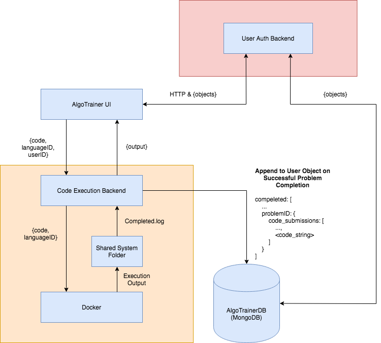

# AlgoTrainer

A web app that allows you to practive your algorithms coding skills.

This repository contains the user interface and its logic for the AlgoTrainer website.

# Architecture

## UI (React Frontend)
The UI is written in React.js.

## User Auth (Backend)
The user auth backend is written in Node.js, making use of the express package. The auth system is oriented around JavaScript Web Tokens (JWT).

## Code Execution (Backend)
The Code Execution backend is a sandbox living inside a docker container that allows potentially unsafe code to be executed and evalutated.